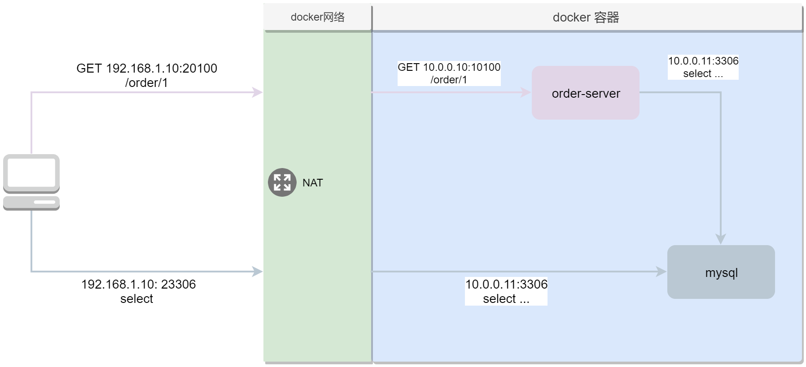

# 场景1-自写应用连mysql数据库

## 场景部署图

## 前置知识

### 命令相关

* docker帮助命令: docker help `指令`, 如: `docker help build`, `docker help run`.
* docker build
  * 关键参数: `-f`, `-t`, `上下文路径`, `--rm`, `help`
    * `-f`: 指定Dockerfile路径
    * `-t`: 指定打包镜像的tag名称(包含镜像名称)
    * `上下文路径`: 指定打包镜像时容器运行时对应容器外部存储的根路径目录
    * `--rm`: 构建成功后删除临时构建容器
* docker run
  * 关键参数: `-it`, `--name`, `-p`, `-e`
    * `-it`: 支持交互模式和开启tty.
    * `--name`: 启动容器后的容器名称
    * `-p`: 容器外-内端口映射
    * `-e`: 注入指定的环境变量, 如果有多个环境变量, 使用多个`-e`进行设置, 如: `-e company=x22x22 -e author=kdump`
  * 高级参数: `--rm`, `--network`, `--restart`, `--link`
    * `--rm`: 容器停止或自动删除, 适用于临时开启的容器.
    * `--network`: 选择容器所运行的网络
    * `--restart`: 容器在非正常情况下停止下重启策略
    * `--link`: 与其它容器关联, 让容器间可以使用别名通讯
    * `--network-alias`: 与其它容器关联, 让容器间可以使用别名通讯

### Dockerfile

* 关键指令

| 指令名      | 说明                     | 备注                                                                                                                                                                                      |
| ----------- | ------------------------ | ----------------------------------------------------------------------------------------------------------------------------------------------------------------------------------------- |
| FROM        | 引用基础镜像             | [FROM说明](https://docs.docker.com/engine/reference/builder/#from)                                                                                                                        |
| AS          | 多阶镜像构建别名         | 一般用于需要有多个阶段的镜像构建 比如先要build一个jar包, 再仅仅将这个jar放入最终的镜像中, 保证镜像的最小化, [AS说明](https://docs.docker.com/develop/develop-images/multistage-build/) |
| WORKDIR     | 工作目录                 | 即bash默认进入的目录, 或者默认相对路径的根目录 , [WORKDIR说明](https://docs.docker.com/engine/reference/builder/#workdir)                                                                 |
| RUN         | 执行系统内的命令         | [RUN说明](https://docs.docker.com/engine/reference/builder/#run)                                                                                                                          |
| COPY        | 存储复制                 | 将本地存储内容复制到镜像中, [COPY说明](https://docs.docker.com/engine/reference/builder/#copy), 类似功能指令: [ADD](https://docs.docker.com/engine/reference/builder/#add)                |
| COPY --from | 指定复制的内容的阶段     | [COPY说明](https://docs.docker.com/engine/reference/builder/#copy) --from可以为阶段别名或者阶段序号, 阶段序号从0开始 如: --from=builder或者--from=0                              |
| ENV         | 设置环境变量             | [ENV说明](https://docs.docker.com/engine/reference/builder/#environment-replacement)                                                                                                      |
| CMD         | 容器启动后执行的命令内容 | [CMD说明](https://docs.docker.com/engine/reference/builder/#cmd), 类似功能指令: [ENTRYPOINT](https://docs.docker.com/engine/reference/builder/#entrypoint)                                |
| EXPOSE      | 通知容器需要监听的端口   | [EXPOSE说明](https://docs.docker.com/engine/reference/builder/#expose) 如果在docker run的时候指定了-p, 其实是会覆盖此配置. 所以此配置更多情况下是对于--link的一种友好使用方式.         |

### 容器网络

1. [网络类型简介](https://docs.docker.com/network/#network-drivers)
1. [bridge网络介绍](https://docs.docker.com/network/bridge/)
1. [bridge网络教程](https://docs.docker.com/network/network-tutorial-standalone/)

### 实践过程

* [基础版](base.md)
* [进阶版](adv.md)
* [再次进阶](adv_2.md)