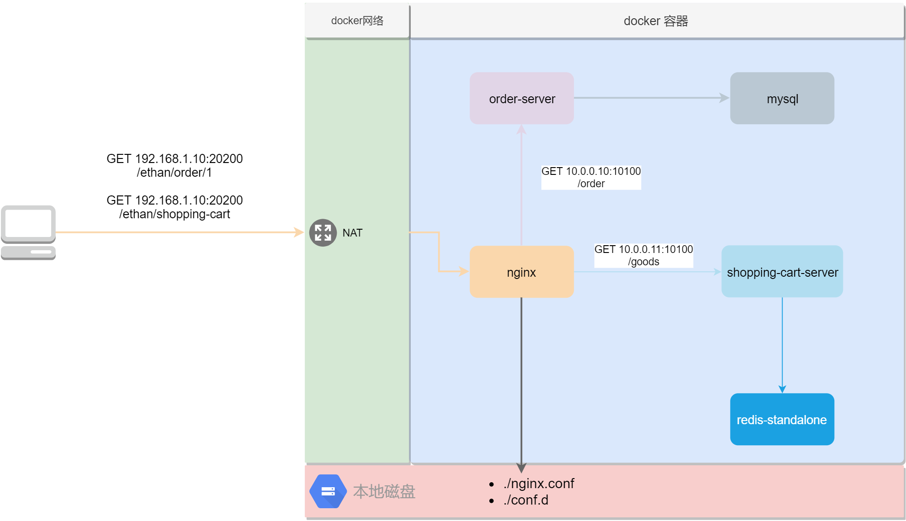

# 场景2-Nginx网关调用多个后端应用

## 场景部署图

## 前置知识

### 命令相关

* docker pull
  * 关键参数: `NAME`, `TAG`, `DIGEST`
    * `NAME`: 镜像名, 主要由四个部分组成: 仓库域名(可省略), 命名空间(项目), 镜像名.
    * `TAG`: 一般为版本号, 约定熟成将`latest`定为最新版本, 每次创建最新的镜像会同时将镜像打成`latest`版本并推送到镜像仓库.
    * `DIGEST`: 有些特殊情况, 会强制指定镜像签名进行镜像的拉去, 因为及时tag相同, 镜像也未必相同.

* docker images
  * 关键参数: `镜像名`
    * `镜像名`: 如果需要筛选镜像列表, 可以在此指定镜像名. 主要由四个部分组成: 仓库域名(可省略), 命名空间(项目), 镜像名, TAG

### 容器存储

1. [容器存储简介](https://docs.docker.com/storage)
1. [挂载bind类型存储](https://docs.docker.com/storage/bind-mounts)
1. [挂载volumes类型存储](https://docs.docker.com/storage/volumes)
1. [挂载tmpfs类型存储](https://docs.docker.com/storage/tmpfs)

### 实践过程

* [基础版](base.md)
* [进阶版](adv.md)
* [清除环境](clean.md)
