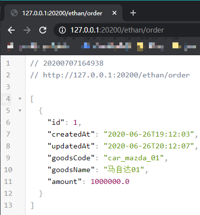
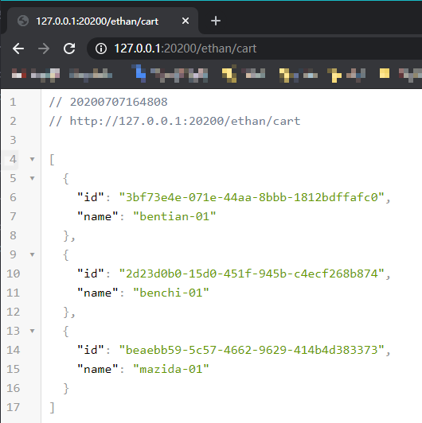

# 基础版

## 清除环境

如果做过`场景1`的实验, 请清除场景1中运行的网络和容器, 具体参考[场景1-清除环境](../scene_1/clean.md)

## 网络

参考[场景1](../scene_1/adv.md#网络)中创建网络.

## 构建

1. order-server:0.0.1-SNAPSHO

    参考[场景1](../scene_1/adv.md#构建)完成构建

1. 构建`shopping-cart-server`镜像

    ```bash
    # 进入./demo/shopping-mall目录下
    docker build \
      -f ./shopping-cart-server/Dockerfile \
      -t shopping-cart-server:0.0.1-SNAPSHO \
      .
    ```

## 启动

1. 启动mysql服务

    ```bash
    docker run --name shopping-mall-mariadb \
      -p 33060:3306 \
      -e MYSQL_ROOT_PASSWORD=x22x22 \
      -e MYSQL_USER=shopping-mall-mariadb \
      -e MYSQL_PASSWORD=shopping-mall-mariadb \
      -e MYSQL_DATABASE=shopping-mall-mariadb \
      --net shopping-mall \
      --network-alias shopping-mall-mariadb \
      -d \
      mariadb:10.5.4
    ```

1. 启动redis服务

    ```bash
    docker run \
      --name shopping-mall-redis \
      --net shopping-mall \
      --network-alias shopping-mall-redis \
      -p 36379:6379 \
      -d \
      redis:6.0.5-buster
    ```

1. 启动order-server:0.0.1-SNAPSHOT

    ```bash
    docker run -d \
      --name order-server \
      -p 38080:38080 \
      --net shopping-mall \
      --network-alias order-server \
      -e spring.r2dbc.url=r2dbc:mysql://shopping-mall-mariadb:3306/shopping-mall-mariadb \
      order-server:0.0.1-SNAPSHOT
    ```

1. 启动shopping-cart-server:0.0.1-SNAPSHOT

    ```bash
    docker run -d \
      --name shopping-cart-server \
      -p 38081:38081 \
      --net shopping-mall \
      --network-alias shopping-cart-server \
      -e spring.redis.host=shopping-mall-redis \
      -e spring.redis.port=6379 \
      shopping-cart-server:0.0.1-SNAPSHOT
    ```

1. 启动nginx

    ```bash
    docker run \
      --name shopping-mall-nginx \
      -d \
      --net shopping-mall \
      --network-alias shopping-mall-nginx \
      --mount type=bind,source="$(pwd)"/nginx/conf.d,target=/etc/nginx/conf.d \
      -p 20200:20200 \
      nginx:1.19.0
    ```

## 验证

1. 获取容器NAT IP
   1. 如果使用[docker desktop](https://www.docker.com/products/docker-desktop)安装的docker, 可以直接使用127.0.0.1进行容器的访问
   1. 如果使用[docker toolbox](https://github.com/docker/toolbox/releases)安装的docker, 请运行以下命令获得容器的IP

      ```bash
      docker-machine env
      # 回显关键内容
      # DOCKER_HOST=tcp://192.168.99.101:2376
      # 其中192.168.99.101为容器的访问IP
      ```

1. 调用`shopping-mall-nginx`服务接口

    * 浏览器中直接打开<http://127.0.0.1:20200/ethan/order>和<http://127.0.0.1:38080/order>链接, 可以看到分别返回对应的服务响应报文.

      ***PS***: 如果是[docker toolbox](https://github.com/docker/toolbox/releases)方式安装的, 请将上面的`127.0.0.1`部分修改为`获取容器NAT IP`章节中获取到的IP, 后面需要访问其它容器也是如此, 就不再重复提示.
    * 调用结果:
      1. 通过`shopping-mall-nginx`调用`order-server`的接口  
          
      1. 通过`shopping-mall-nginx`调用`shopping-cart-server`的接口  
          
